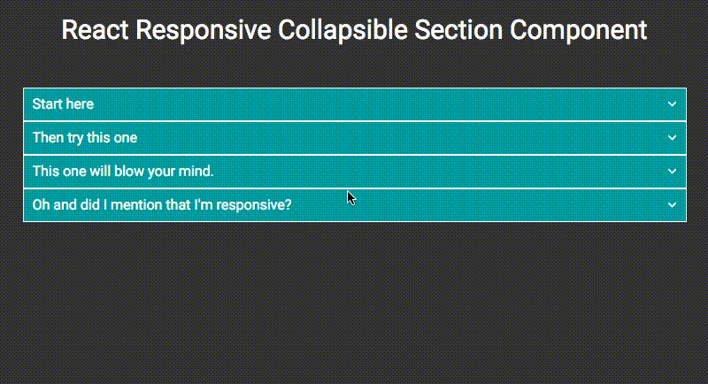

[]()

# React Responsive Collapsible Section Component (Collapsible)

React component to wrap content in Collapsible element with trigger to open and close.



It's like an accordion, but where any number of sections can be open at the same time.

## Installation
Installation can be achieved via NPM.
```
npm install react-collapsible
```

Alternatively just download the `Collapsible.js` file form the `src` folder and include it in your project in your chosen way.

## Usage
Collapsible can receive any HTML elements or React component as it's children. Collapsible will wrap the contents, as well as generate a trigger element which will control showing and hiding.

### ES6
```javascript

import React from 'react';
import Collapsible from 'react-collapsible';

var App = React.createClass({

  render: function() {
    return(

      <Collapsible triggerText="Start here">
        <p>This is the collapsible content. It can be any element or React component you like.</p>
        <p>It can even be another Collapsible component. Check out the next section!</p>
      </Collapsible>

    );
  }

});

export default App;
```

With a little CSS becomes


## Properties *(Options)*

### `triggerText` | *string* | **required**
The text to appear in the trigger link.

### `triggerTextWhenOpen` | *string*
Optional trigger text to change to when the Collapsible is open.

### `transitionTime` | *number* | default: 400
The number of milliseconds for the open/close transition to take.

### `easing` | *string* | default: 'liner'
The CSS easing method you wish to apply to the open/close transition. This string can be any valid value of CSS `transition-timing-function`. For reference view the [MDN documentation](https://developer.mozilla.org/en/docs/Web/CSS/transition-timing-function).

### `open` | *bool* | default: false
Set to true if you want the Collapsible to begin in the open state. You can also use this prop to manage the state from a parent component.

### `classParentString` | *string* | default: Collapsible
Use this to overwrite the parent CSS class for the Collapsible component parts. Read more in the CSS section below.

## CSS Styles
In theory you don't need any CSS to get this to work, but let's face it, it'd be pretty rubbish without it.

By default the parent CSS class name is `.Collapsible` but this can be changed by setting the `classParentString` property on the component.

The CSS class names follow a [type of BEM pattern](http://getbem.com/introduction/) of CSS naming. Below is a list of the CSS classes available on the component.  


### `.Collapsible`
The parent element for the components.

### `.Collapsible__trigger`
The trigger link that controls the opening and closing of the component.
The state of the component is also reflected on this element with the modifier classes;
- `is-closed` | Closed state
- `is-open` | Open setState

### `.Collapsible__contentOuter`
The outer container that hides the content. This is set to `overflow: hidden` within the javascript but everything else about it is for you to change.

### `.Collapsible__contentInner`
This is a container for the content passed into the compoenent. This keeps everything nice and neat and allows the component to do all it's whizzy calculations.


## Example
An example of the component in action is available in the example folder. To see it in action you can run `npm install` and then run `gulp`. This will compile all the JSX into JS and open the example page using BrowserSync.

## Licence
React Responsive Collapsible Section Component is [MIT licensed](LICENSE.md)
